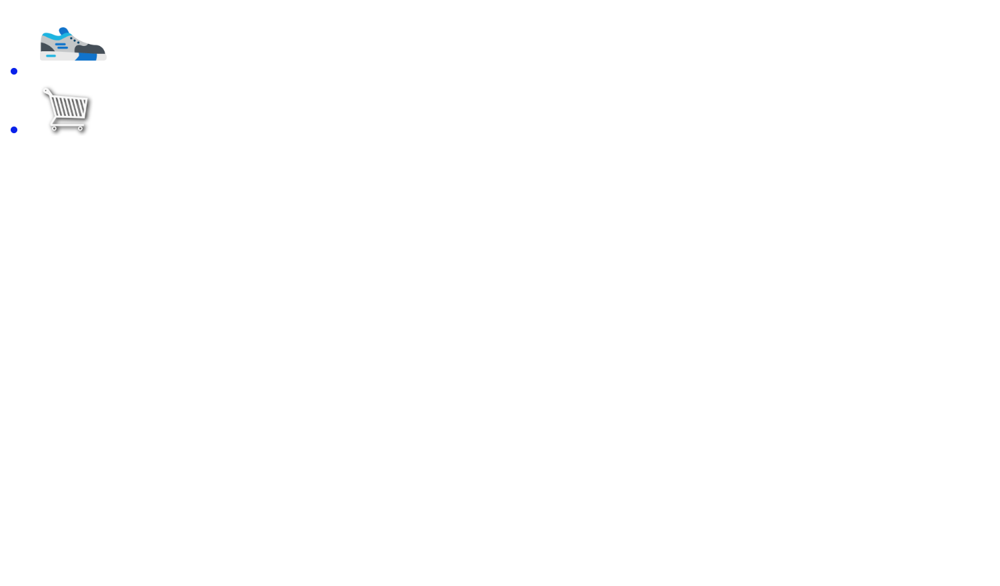
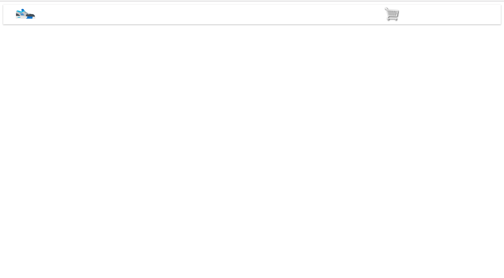

One of the most important parts of a website is their navigation menu. Typically, these are navigation bars at the top of a webpage, but some websites put their navigation on the side.

For this project we will put our navigation on the top of the page.

# Navbar Mark-up
To begin, let's add the following HTML inside of our ```<body>```:

```HTML
<body>

  <div class="nav-bar">
    <nav>
      <div class="nav-links">
        <a class="nav-btn logo" href="#home"></a>
        <a class="nav-btn right" href="#cart"></a>
      </div>
    </nav>
  </div>

  <script src="index.js"></script>
</body>
```

The first thing we did was wrap our elements inside of a parent div called ```nav-bar```. Inside of this ```div``` we added in our ```<nav>``` tag. Next we added another parent div to store our links into.

We decided to use a logo for the Home button, and we also added in a shopping cart.

Right now our page looks like this:



In order to get it to look like a navbar, we will need to give it some CSS. We will do bit by bit inside of our styles.css file.


# Styleing the Navbar

At the top of our page in ```styles.css``` lets add a comment that tells us what section we're in, and a few styles:

```CSS
/***********
NAVBAR
***********/

.navbar {
  z-index: 10;
  width: 100%;
}

```
We give our parent navbar class a higher z-index and a width of 100% so it goes across the page.

The next thing we'll do is add some styles to get our images to display horizontally.

```css
.navbar {
  z-index: 10;
  width: 100%;
}

.nav-links {
  height: 50px;
  width: 100%;
  background: white;
  display: flex;
  flex-direction: row;
  justify-content: flex-start;
  align-items: center;
}


```
Woah! What's this flex stuff? This is called Flexbox. Flexbox allows us to layout elements easily. In order to use it, we need to give our parent ```<div>``` a ```display: flex;``` property. We then specify that it should be a row, and that we want to justify our content to the beginning. 

We will use a bunch of different flexbox styles throughout this tutorial.

That should get our elements to display inline. Let's add a few more styles to complete the look.

```CSS
.nav-btn {
  text-decoration: none;
  list-style-type: none;
  color: black;
  margin-left: 2rem;
  transition: all 200ms;
}

.nav-btn:hover {
  transform: scale(1.1);
}
```
The transition property was given the attribute: ```all 200ms```. A CSS transition defines the unit of time it takes to transition a change in property values. The all keyword let's us attatch a transition to everything. 

Let's continue:

```CSS
.nav-btn.logo {
  transition: all 300ms;
}

.nav-btn.logo:hover {
  transform: scale(1.1) rotate(5deg) translateX(10px);
}

.nav-btn.right {
  margin-left: 85%;
  transition: all 300ms;
}

.nav-btn.right:hover {
  transform: scale(1.1) rotate(3deg);
}

```

Your page should now look something like this:



You'll notice that it isn't quite flush with the borders of the browser yet. This is because the <body> tag actually adds a little bit of margin. We can get rid of that with the following styles:

```CSS

body {
  margin: 0;
}

/***********
NAVBAR
***********/

```
There we go, that fixed it.

If you hover over one of the images, you'll notice that some interesting things happen to them. This is because we applied some element state rules in our CSS.

```css
/*you should already have this code, no need to write it again*/

.nav-btn.logo:hover {
  transform: scale(1.1) rotate(5deg) translateX(10px);
}

```
After any selector, if you add :hover, you'll be able to change the way it looks when hovered. Feel free to mess with these styles as you wish. You aren't limited to the transform property.

See [this for more information on CSS psuedo classes.](https://developer.mozilla.org/en-US/docs/Web/CSS/Pseudo-classes)

We will revisit the navbar in the future.

# Going forward
Now that we've finished our navbar, it's time to add in our Hero Section! 
