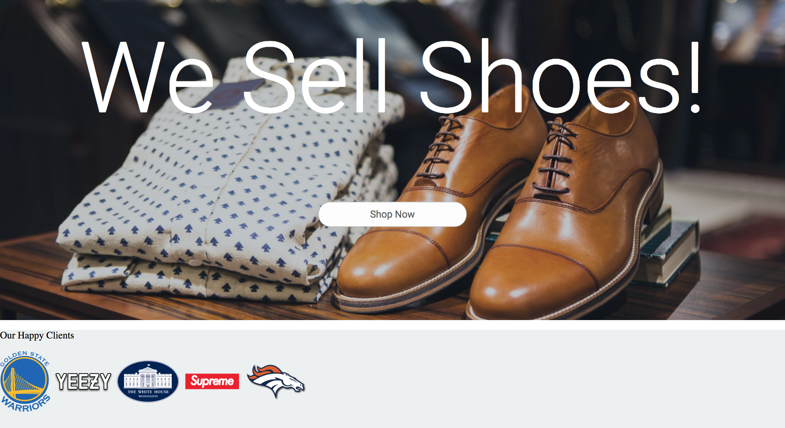

Many website, especially ones for startups like to showcase different clients that use their products/software.

We are going to do the same on our landing page.

# Client markup

Let's start again by adding in some markup.

```HTML
</div><!--closing hero div-->

<div class="clients">
  <p class="clients-header">Our Happy Clients</p>
  <div class="client-images">
    
    
    
    
    
  </div>
</div>
```
Feel welcome to change the images as needed!

We've created a parent div with the clients class, we have some text to show what this section is for, and we have a child div that contains some images of corporate logos.

We can now add some styles to these.

# Adding styles

At the bottom of our stylesheet lets add in the following:

```CSS
/*******************
clients
*******************/

.clients {
  height: 10rem;
  width: 100%;
  background: #ecf0f1;
}

```

We'll get a section that looks a bit like this, but we're not yet done with adding styles that will space everything out.



So let's add some more styles in order to get our images inline:

```CSS
...

.client-images {
  display: flex;
  flex-direction: row;
  justify-content: space-around;
  width: 100%;
  height: 100%;
}

```

This will lay our images out rather nicely. The next thing we can do is fix the heading:

```CSS
...

.clients-header {
  margin: 0;
  padding-top: 1rem;
  text-align: center;
  font-size: 1.4rem;
  font-family: roboto;
  font-weight: 400;
}

```
Setting the margin to 0 gets rid of the extra white space above. Feel free to play with the font size as well.

We give it a font weight of 400 to make it slightly bolded.

# Make the images slghtly interactive

In order to make our images a little more lively, we can add some transitions and hover effects.

```CSS
.client-images img {
  transition: all 200ms;
}

.client-images img:hover {
  transform: scale(1.2);
}

```

This gives us a nice scale effect on hover. Feel free to adjust this as you wish.

# onward

Our landing page is really starting to come together. In the next section we will add a newsletter subscription panel.
