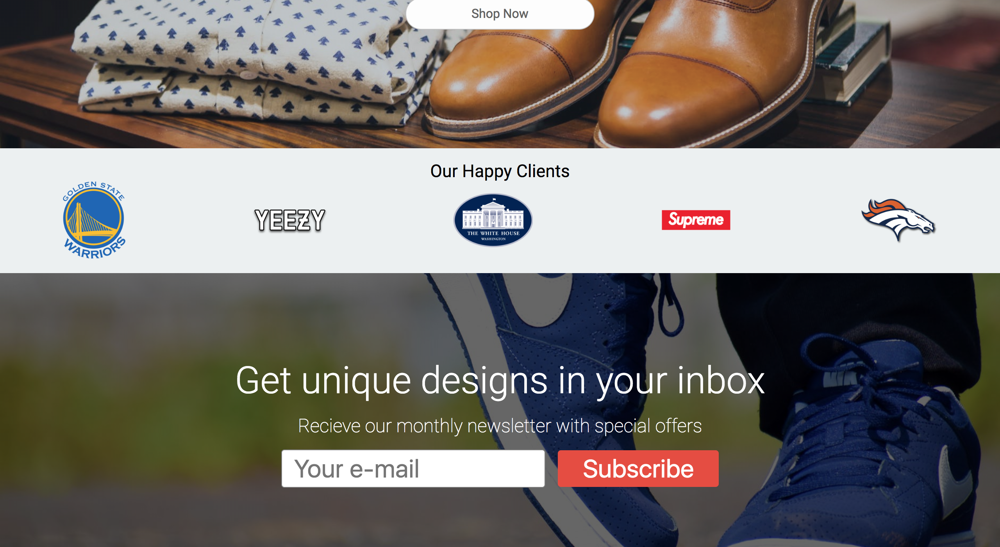

One of the most important aspects of modern landing pages is directing users to sign up for newsletters.

We are going to create an input field with a subscribe button, and wrap it over a nice parallaxed background.

# Adding in the markup

Let's start again by adding in some HTML:

```HTML
</div><!--end of clients section-->

<div class="subscribe">
  <h1>Get unique designs in your inbox</h1>
  <h3>Recieve our monthly newsletter with special offers</h3>
  <div class="sub-fields">
    <input class="email-input" placeholder="Your e-mail"><button class="email-sub">Subscribe</button>
  </div>
</div>
```
As always, feel free to change some of the text as you wish.

We want our subscribe Div to take up a sufficient amount of space, and add a background image to it. Our sub-fields will have some styles that will get our input and button tags aligned in a row.

With our new style plan, we can begin to add some CSS.

# Adding styles

 At the bottom of our stylesheet lets add these lines of CSS:

 ```CSS
 /******************
 subscribe
 ******************/

 .subscribe {
   height: 50vh;
   width: 100%;
   background: linear-gradient(rgba(0,0,0,.6), rgba(0,0,0,.6)), url('https://images.pexels.com/photos/637076/pexels-photo-637076.jpeg?auto=compress&cs=tinysrgb&dpr=2&h=650&w=940');
   background-size: cover;
   background-position: center;
   background-attachment: fixed;
   display: flex;
   flex-direction: column;
   justify-content: center;
   align-items: center;
   color: white;
 }

 ```
 Take note of ```background-attachment: fixed;```. This is what adds the paralax effect onto our image.

 The next bit we can add is add the headings:

 ```CSS
 .subscribe h1 {
   font-size: 3rem;
   margin-bottom: 1rem;
   font-family: roboto;
   font-weight: 300;
 }

 .subscribe h3 {
   margin: 0;
   font-size: 1.5rem;
   margin-bottom: 1rem;
   font-family: roboto;
   font-weight: 200;
 }
 ```
We give the larger header a higher font-weight so that we can tell it's a title, and that the h3 is a subtitle.

Now we can add some styles for the buttons:

```CSS
.email-input {
  border-radius: 4px;
  border: solid 1px gray;
  font-size: 2rem;
  padding: .3rem;
  padding-left: 1rem;
  transition: all 200ms;
}

.email-sub {
  margin-left: 1rem;
  font-size: 2rem;
  padding-top: .3rem;
  padding-bottom: .3rem;
  padding-left: 2rem;
  padding-right: 2rem;
  border: none;
  border-radius: 4px;
  color: white;
  background: #e74c3c;
  transition: all 200ms;
  cursor: pointer;
}

```

We added a transition effect to both of these so that we can style some animations on hover. Lets do that now:

```CSS
.email-input:hover {
  transform: scale(1.05);
}

.email-sub:hover {
  transform: scale(1.05);
}
```

As always, feel free to experiment with these hover effects to insure a pleasent experience for the end user.

We should now have a page that looks like this:

  

# Onward
The next step is creating the gallery. This is one of the most important parts of any shop. Without a gallery our users won't be able to view our products.

We will also introduce CSS Grid in this section so stay tuned.
