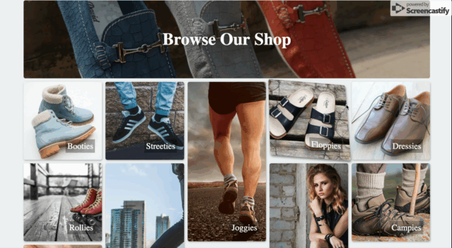

The gallery is one of the coolest things about this tutorial. We'll take it slow together so you can replicate this with ease in the future.

# Mark it up

Let's start off with some very basic mark up shall we?

```HTML
</div><!--end of subscribe div-->

<div class="gallery-sec">
  <div class="gallery">
    <h1 class="g-header">Browse Our Shop</h1>

    <div class="panel a"><div>Booties</div></div>
    <div class="panel b"><div>Streeties</div></div>
    <div class="panel tall-panel c"><div>Joggies</div></div>
    <div class="panel d"><div>Floppies</div></div>
    <div class="panel e"><div>Dressies</div></div>
    <div class="panel f"><div>Rollies</div></div>
    <div class="panel tall-panel g"><div>Sneakies</div></div>
    <div class="panel tall-panel h"><div>Edgies</div></div>
    <div class="panel i"><div>Campies</div></div>
    <div class="panel j"><div>Cheeties</div></div>
  </div>
</div>
```

The *gallery-sec* div will hold our gallery.

The gallery itself will be inside of the *gallery* div.

Each item inside of the gallery div will have the panel class, a few will hold the tall-panel class, and the each will lettered from a to j, so that we can give each one a unique background.

We can now add some CSS to create our gallery.

# Adding some styles

Inside of our stylesheet, at the bottom, lets add these:

```CSS

/*******************
gallery
*******************/


.gallery-sec {
  /*padding: .3rem;*/
  margin-right: .3rem;
  height: 130vh;
  background: #ecf0f1;
  height: 130vh;
  width: 100%;
  padding: 3px;
  padding-top: 10px;
  padding-bottom: 10px;
}

.gallery {
  height: 100%;
  width: 90%;
  /*overflow-x: hidden;*/
  display: grid;
  grid-gap: 10px;
  perspective: 800px;
}
```
The same way we setup flexbox by using ```display: flex```, we set up grid by doing: ```display: grid```.

The grid-gap property defines the space in between each grid item.

Perspective is used to create a 3D space. You'll see why in a bit. For now let's keep going:

```CSS
.gallery {
  display: flex;
  flex-wrap: wrap;
}

.gallery {
  display: grid;
  margin: 0 auto;
  grid-template-columns: repeat(auto-fill, minmax(200px, 1fr));
  grid-auto-rows: minmax(150px, auto);
}

```
The reason why we have a few different instances of the gallery class is so we can target different things with it.

Currently CSS Grid isn't supported by all browsers, so we can default it to flexbox when grid isn't supported.

## Explanation

So we've given it a ```display: grid```, with a ```grid-gap: 10px```. This is so theres a little bit of space between each grid item. The perspective we've added to the grid is going to help with some 3d transformations on the grid items for a cool interactive effect.

We then set the number of ```grid-template-columns``` to ```repeat(auto-fill, minmax(200px. 1fr))``` which makes the columns repeat as many times as there is space, and gives each item the ability to be as tall as we want. We do this same thing for rows, by setting it to auto-rows which creates as many rows as needed.

If you want to become a master of CSS grid, I reccomend: http://cssgridgarden.com/

## Continue on

Move onward with our styles, we will add the following CSS below what we previously added:

```CSS
.panel {
  /* needed for the flex layout*/
  margin-left: 5px;
  margin-right: 5px;
  flex: 1 1 200px;
  display: flex;
  justify-content: flex-end;
  align-items: flex-end;
  box-shadow: 1px 2px 6px rgba(0,0,0,.3);
  transition: all 300ms;
  transform-style: preserve-3d;
  background-size: cover;
  background-position: center;
}


.tall-panel {
  grid-row-end: span 2;
}

.g-header
 {
  margin-left: 5px;
  margin-right: 5px;
  flex: 0 1 100%;
  grid-column: 1 / -1;
}

.gallery > * {
  background-color: #fff;
  color: #000;
  border-radius: 5px;
  padding: 20px;
  font-size: 150%;
  margin-bottom: 10px;
}

.g-header {
  display: flex;
  justify-content: center;
  align-items: center;
  font-size: 3rem;
  background: linear-gradient(rgba(0,0,0,.3), rgba(0,0,0,.3)), url('https://images.pexels.com/photos/267320/pexels-photo-267320.jpeg?auto=compress&cs=tinysrgb&dpr=2&h=650&w=940');
  background-size: cover;
  background-position: center;
  color: white;
}

.a {
  background: url('https://images.pexels.com/photos/266840/pexels-photo-266840.jpeg?auto=compress&cs=tinysrgb&dpr=2&h=650&w=940');
  background-size: cover;
}

.b {
  background: url('https://images.pexels.com/photos/812875/pexels-photo-812875.jpeg?auto=compress&cs=tinysrgb&dpr=2&h=650&w=940');
  background-size: cover;
}

.c {
  background: url('https://images.pexels.com/photos/421160/pexels-photo-421160.jpeg?auto=compress&cs=tinysrgb&dpr=2&h=650&w=940');
  background-position: -70px;
}

.d {
  background: url('https://images.pexels.com/photos/112285/pexels-photo-112285.jpeg?auto=compress&cs=tinysrgb&dpr=2&h=650&w=940');
  background-size: cover;
}

.e {
  background: url('https://images.pexels.com/photos/293405/pexels-photo-293405.jpeg?auto=compress&cs=tinysrgb&dpr=2&h=650&w=940');
  background-size: cover;  
}

.f {
  background: url('https://images.pexels.com/photos/1994/red-vintage-shoes-sport.jpg?auto=compress&cs=tinysrgb&dpr=2&h=650&w=940');
  background-repeat: no-repeat;
  background-size: cover;  
  background-position: -40px;
}


.g {
  background: url('https://images.pexels.com/photos/373964/pexels-photo-373964.jpeg?auto=compress&cs=tinysrgb&dpr=2&h=650&w=940');
  background-position: -100px;
  background-size: cover;
}

.h {
  background: url('https://images.pexels.com/photos/247203/pexels-photo-247203.jpeg?auto=compress&cs=tinysrgb&dpr=2&h=650&w=940');
  background-size: cover;  
}

.i {
  background: url('https://images.pexels.com/photos/40383/shoes-rock-climbing-hiking-walking-40383.jpeg?auto=compress&cs=tinysrgb&dpr=2&h=650&w=940');
  background-size: cover;  
}

.j {
  background: url('https://images.pexels.com/photos/116150/pexels-photo-116150.jpeg?auto=compress&cs=tinysrgb&dpr=2&h=650&w=940');
  background-position: 0px -60px;
}

.panel div {
  background: rgba(0,0,0,.3);
  padding: 5px;
  color: white;
}

/* We need to set the margin used on flex items to 0 as we have gaps in grid.  */

@supports (display: grid) {
  .gallery > * {
    margin: 0;
  }
}

```

Wow! That was a lot. So let's explain a little bit of what we did. We gave each item it's own background, and we gave a few the tall-panel class in addition.

We set each item to be the same width and height so that everything lines up well. The tall-panel class has a bit more height than the others which gives a diverse effect.

We gave our ```.panel``` class a transform-style: preserve-3d so that we can do some fun 3d transforms on hover. Let's go ahead and do that now!

```CSS
you already have this .panel class.
.panel {
  /* needed for the flex layout*/
  margin-left: 5px;
  margin-right: 5px;
  flex: 1 1 200px;
  display: flex;
  justify-content: flex-end;
  align-items: flex-end;
  box-shadow: 1px 2px 6px rgba(0,0,0,.3);
  transition: all 300ms;
  transform-style: preserve-3d;
}

add these lines below
.panel:hover {
  transform: scale(1.01) translateY(-5px) rotateX(10deg) rotateY(2deg) skewY(4deg);
  box-shadow: 1px 4px 9px rgba(0,0,0,.5);
  z-index: 3;
}
```
I encourage you to mess around with these properties and watch what happens. You can create some really interesting effects. It's worth tweaking things like scale, and rotateX/rotateY to see what you can do.

We should now have something that looks a little like this:

 

# Onward

In the next session, we will add another subscribe panel with parallax. This should be pretty easy because we already have most of the CSS we will need for it. 
