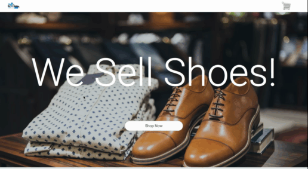

In the last section we created an FAQ accordion. In this section we are going to create the Footer of the website!

We are in the home stretch. Let's dive right into it.

# Adding the markup
Below our FAQ Section, let's add in our Footer Markup:

```HTML
<div class="footer">
  <div class="container">
    <div class="footer-cta">
      <h3>We sell shoes</h3>
      <p>Please, please, please, buy our shoes.</p>
      <br />
      <a class="call-to-action-btn" href="#">Shop Now</a>

    </div>
    <div class="footer-links">
      <h3>Links</h3>
        <li><a href="#">Home</a></li>
        <li><a href="#">Contact Us</a></li>
        <li><a href="#">Shop</a></li>
        <li><a href="#">Careers</a></li>
        <li><a href="#">Investors</a></li>
    </div>

  </div>
</div>
<div class="footer-copyright">
  <div class="container row">
    <div>© 2018 Copyright by We Sell Shoes</div>
    <div class="more-links">More Links</div>
  </div>
</div>

```
Our footer is built in two section, the top part and the bottom part. The top part contains information and some relevent links, and the bottom shows the copy right info.

Now that we've got in our footer ```html``` lets go ahead and add some styles.

# Styling That Footer

At the bottom of your stylesheet, add the following:

```CSS
/**************
Footer
**************/

.footer {
  height: 30vh;
  margin: 0;
  background: #34495e;
  color: white;
  display: flex;
  justify-content: center;
  align-items: center;
  font-family: roboto;
}

.container {
  width: 80%;
  display: flex;
  flex-direction: row;
  justify-content: space-around;
}

.footer-cta {
  display: flex;
  flex-direction: column;
}

.footer-cta p {
  margin: 0;
}

h3 {
  margin-top: 0;
}

.footer-links {
  text-align: left;
}

.footer-links li {
  list-style: none;
}


.footer-links a {
  text-decoration: none;
  color: white;
  text-align: left;
}

.footer-copyright {
  height: 5vh;
  display: flex;
  justify-content: center;
  align-items: center;
  background: #2c3e50;
  color: white;
}

.row {
  display: flex;
  flex-direction: row;
  justify-content: space-around;
}

.more-links {
  cursor: pointer;
}
```  

Awesome. Now we've got a pretty radical footer.

Our website is now mostly done, let's take a quick look again!



But we're still not done, there's one final thing we need to do.

# Onward

In the next section we are going to create a popup form with an incentive to subscribe.   
