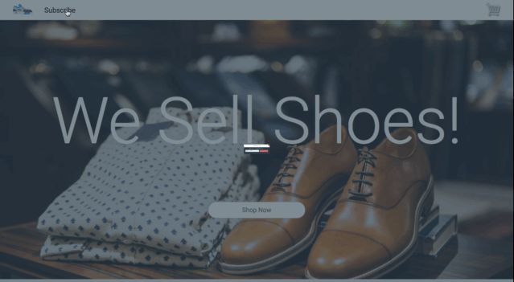

Alright, this is the final section, so get excited.

We are going to create a pop-up form, and it's going to be awesome.

Lets first start with adding a button to the navbar.

# Mark It

Inside of of navigation menu, let's add the following:

```html
<!--you already have this-->
<div class="nav-bar">
  <nav>
    <div class="nav-links">
      <a class="nav-btn logo" href="#home"><li></li></a>

      <!--add this part-->
      <a id="sub-btn" class="nav-btn" href="#contact"><li>Subscribe</li></a>

      <!--you already have this-->
      <a class="nav-btn right" href="#cart"><li></li></a>
    </div>
  </nav>
</div>
```
You'll notice that this button has an id on it, this means we are planning to add some functionality to it with javascript.

Before we continue though, lets change a few styles in the navbar:

```css

.nav-btn.right {
  margin-left: 80%; /*made this smaller*/
  transition: all 300ms;
}


.nav-links {
  height: 50px;
  width: 100%;
  background: white;
  display: flex;
  flex-direction: row;
  justify-content: flex-start;
  align-items: center;
  font-family: roboto; /*made font-family roboto*/
}

```

Great, now we are set to add the next part, which is the markup for the pop-up itself.

# Pop it
At the top of our index.html file, right after the opening <body> tag, let's add the following:

```html
<body>
  <!--everything below this line-->

  <div id="pop-up-layer" class="pop-up-layer">
    <div id="pop-up" class="pop-up">
      <h1 class="pop-up-title">Get Rewards!</h1>
      <h2 class="pop-up-sub">Subscribe for 15% off at checkout!</h2>
      <div class="sub-fields">
        <input class="email-input" placeholder="Your e-mail"><button class="email-sub">Subscribe</button>
      </div>
      <button id="close-pop-up" class="close-btn">X</button>
    </div>
  </div>

<!--everything above this line-->
<div class="nav-bar">
```
Let's talk about this. We have a pop-up-layer that everything is nested into.

This pop-up layer is going to take up the entire page, it will be a transparent overlay.

Then we have the form itself, an incentive to subscribe, and a closing X button to exit the modal.

Now we are ready to add some styles.

# Pop In Style!   

We are going to do some fun stuff with this pop-up. Let's get started.

At the **top** of our stylesheet, let's add the following:

```css
body {
  margin: 0;
  -webkit-font-smoothing: subpixel-antialiased; /*If you don't have this, add it in! */
  overflow-x: hidden;
}

/*everything below this line*/

/*******
Popup
********/


@keyframes hop-down {
  0% {
    transform: scale(.1) translateY(200px);
  }


  100% {
    transform: scale(1) translateY(0px;);
  }

}


```
Let's stop right here and explain what this is. When we use the ```@keyframes``` selector, that means we are creating an animation. You've probably been exposed to CSS Animations before, and many developers make use of libraries such as animate.css and [Woah.css](http://www.joerezendes.com/projects/Woah.css/).

We just made our very own animation for the pop-up form.

All we're doing here, is specifying the state the element should be in at 0% of the animation, and then 100%. CSS Magic does the rest for us. If we want to, we can specify other percents as well, such as 50% to give a halfway mark, and much more.

For a more in depth look on some interesting animations I suggest you check out the source code for [this](http://www.joerezendes.com/projects/Woah.css/).

Let's continue:

```css
.pop-up-layer {
  opacity: 0%;
  display: none; /*we will change this with javascript*/
  position: fixed;
  height: 100vh;
  width: 100%;
  background: rgba(44, 62, 80,.6); /*this is our overlay color*/
  z-index: 100; /*makes our layer above the rest of the page.*/
}

.pop-up {
  position: fixed; /*this makes our pop-up attached to the screen*/
  top: 0; left: 0; right: 0; bottom: 0;
  margin: auto; /*aligns our popup to the center*/
  height: 15rem;
  width: 40rem;
  display: flex;
  flex-direction: column;
  justify-content: center;
  align-items: center;
  background: #2c3e50;
  border-radius: 16px;
  box-shadow: 0 4px 3px rgba(0,0,0,.3);
  z-index: 10000000; /*Makes our pop-up above everything*/
  animation: hop-down;
  animation-duration: 100ms;
  animation-fill-mode: both;
  animation-timing-function: linear;
}
```
At the bottom of ```.pop-up``` we see some animation functions.

We set the animation name by just calling the ```@keyframes``` we created.
We can change the duration to anything we want, in this case, we want our animation to be pretty quick.

The fill-mode of ```both``` makes our animation retain it's state before and after the animation occurs.

And the timing function of linear makes our animation move steadily. For more information on timing functions check [this](https://easings.net/) out.

Now we can pretty safely add in the rest.

```css
.pop-up-title {
  position: absolute;
  padding-top: 1rem;
  padding-bottom: 1rem;
  top: 0;
  left: 0;
  background: white;
  margin-top: 0;
  width: 100%;
  text-align: center;
  color: black;
  font-weight: 300;
  border-top-left-radius: 16px;
  border-top-right-radius: 16px;
  font-family: roboto;
}

.pop-up-sub {
  padding-top: 1rem;
  text-align: center;
  color: white;
  font-weight: 300;
  font-family: roboto;
}

.close-btn {
  position: absolute;
  top: 0;        /* we put this button at */
  right: 0rem;    /* the top right */
  margin-top: 0rem;
  background: #e74c3c;
  color: white;
  border: none;
  font-size: 20px;
  transition: all 200ms;
  cursor: pointer;
  border-top-right-radius: 16px;
  border-bottom-left-radius: 16px;
  padding-left: 12px;
  padding-bottom: 8px;
  padding-top: 5px;
  padding-right: 9px;
}

.close-btn:hover {
  background: #c0392b;
}

```
And those are all the styles we need. We're in the home stretch now. Let's add in some javascript.

# Scripting our Pop-Up!
We'll get straight into it.

At the top of your javascript file, let's add the following:

```js
/////////popup//////////////

//declare default vars
const popUp = document.getElementById('pop-up');
const popUpLayer = document.getElementById('pop-up-layer');
const closeModal = document.getElementById('close-pop-up');

//nav-bar button
const subBtn = document.getElementById('sub-btn');
```

Great, now we can add some event listeners below.

```js
//navbar button click makes the popup appear
subBtn.addEventListener("click", () => {
  popUpLayer.style.display = 'flex';
})

//close model click makes the popup disappear
closeModal.addEventListener("click", function() {
  popUpLayer.style.display = 'none';
})

```

Awesome, now all we have to do is make the pop-up appear after a certain amount of time.

```js

let popUpSeconds = 40;

//trigger popup after seconds variable
let popUpFun = window.setInterval(function() {
  popUpLayer.style.display = 'flex';

  window.clearInterval(popUpFun);

}, popUpSeconds * 1000);

///////////////////


```
We multiply the popUpSeconds by 1000 because intervals keep track of milleseconds.

We should now have a pop-up that looks like this:



# Onward
We've established some awesome CSS and JS skills for building static landing pages.

I encourage you to work with some of these skills a little bit more so that you can master these concepts!
